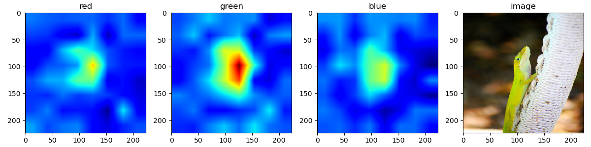
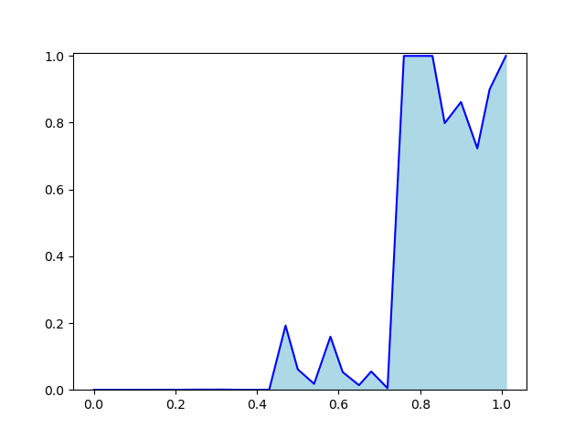
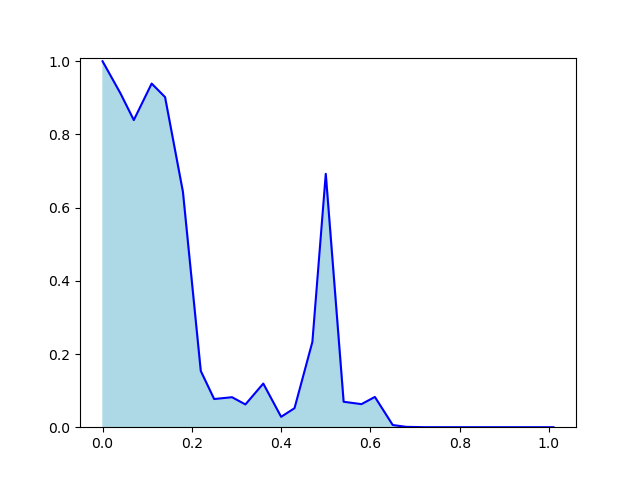

# nisawa_work
This repository provides data and codes
# Contents
1. Instlation
2. Structure of folders and files
3. Citation
# Requirement
+ Python 3.7.10
+ tensprflow 2.2.0
# Installation
To get started with the project, follow these steps:
1. Clone the repository.
```
$ git clone https://github.com/nisawadaiki/nisawa_work.git
```

2.  Install the required packages from the requirements.txt file using conda:
```
$ pip install -r requirements.txt
```
3. Download each dataset and pretrained model, GTSRB() and GTSRB prtrained model(https://drive.google.com/file/d/1je-NzsfB9X1Y2nJQTrB0QYc0-i8LGHOv/view?usp=drive_link , https://drive.google.com/file/d/18GfZdHX4911gPC1KwZ2oPOYbKyms1NHs/view?usp=drive_link) ImageNet(ファイルがでかいため置ける場所がないです)

5. ダウンロードしたzipを解凍し、imagesの中のフォルダをGTSRB/images/の中に入れる。学習済みモデルファイル(h5)はGTSRB/result/checkpoint/のフォルダを作成し、その中に入れる。ImageNetは、zipを解凍し、/data1/nisawa/nisawa_works/ImageNet/images/pickle/フォルダを作り、中に入れる。

6. Execute run.py of each CAM method as follows:
```
:$ python 
(default):$ python run.py [-device_num] [-data] [-mode] [--make_mask] [-mask_num] [-eval_sal] [--run_ins_del] [--run_adcc] [--hsv]
```
Option:
- device_num : int,default=0
  - use GPU device number : deep1 0 or 1 (default:0)
- data : string, default='GTSRB'
    - dataset
      - GTSRB
      - ImageNet
- 　mode: string, default='RaCF'
  - method: RaCF, RaCF_GradCAN, MC-RISE
  - evaluate:eval
- --make_mask:　指定しなければ作ったマスクをロード(指定でマスクを作成、保存)
- -mask_num: int ,default=5000
    - マスク数を決める　どのマスク数のフォルダを指定するかも含まれるので5000枚以外は必ず指定
-  -eval_sal : string ,default='RaCF'
    - -mode='eval'の時、どの手法を評価するかを決定  
- --run_ins_del: -mode='eval'の時、指定することで評価指標insertion,deletionを実行
- --run_adcc: -mode='eval'の時、指定することで評価指標adccを実行
- --hsv:指定することでGTSRBのデータをHSVに変換

# Structure of folders and files
```
.
├── run.py
├── util.py
├── make_saliency.py
├── make_maks.py
├── requirements.txt
├── method
│   ├── RaCF.py
│   ├── RaCFplusGardCAM.py
│   ├── MC_RISE.py
├── GTSRB
│   ├── evaluate.py
│   ├── make_data.py
│   ├── vgg16.py
├── ImageNet
│   ├── evaluate.py
│   ├── make_data.py

```
# RaCF
# tasks
分類の際に、どのチャンネルが重要かを可視化する。RaCF,RaCF+GradCAM,MC-RISEの３つの手法を用いる。それぞれの手法のマップを生成するコマンドは以下のようになる。
- GTSRBの場合(--make_maskは各マスク数において初回だけでよい)
:RaCF(マスク数5000枚)
```
:$ python run.py --make_mask
```
RaCF+GradCAM(マスク数5000枚)
```
:$ python run.py -mode='Racf_GardCAM'
```
RaCF(マスク数5000枚)
```
:$ python run.py -mode='MC-RISE'
```
- ImageNetの場合(--make_maskは初回だけでよい)
:RaCF(マスク数5000枚)
```
:$ python run.py -data='ImageNet' --make_mask
```
RaCF+GradCAM(マスク数5000枚)
```
:$ python run.py -mode='Racf_GardCAM' -data='ImageNet' 
```
RaCF(マスク数5000枚)
```
:$ python run.py -mode='MC-RISE' -data='ImageNet' 
```
- 手法の評価:RaCF
```
:$ python run.py -mode='eval' -eval_sal='RaCF' --run_ins_del --run_adcc
```
Racf_GardCAM
```
:$ python run.py -mode='eval' -eval_sal='Racf_GardCAM' --run_ins_del --run_adcc
```
MC-RISE
```
:$ python run.py -mode='eval' -eval_sal='MC-RISE' --run_ins_del --run_adcc
```

- demo.pyを使用することで、画像単体でのチャンネル重要度の可視化とinsertion,deletion,ADCCの結果を見ることができる(modeは3つから選ぶ)
  -GTSRBは画像の名前を選ぶ ImageNetはpickleファイルにある画像をsplitすることで選択する 
```
:$ python demo.py -mode='RaCF' -gtsrb_name='stop.jpg' --run_ins_del --run_adcc
:$ python demo.py -data='ImageNet' -imagenet_split=50 -mode='RaCF' --run_ins_del --run_adcc
```
- 結果の例 (python demo.py -data='ImageNet' -imagenet_split=50 -mode='RaCF' --run_ins_del --run_adccを実行、ターミナル上にinsertion,deletion,adccの数値が出てきます)
  - 重要度マップ
       
  - insertion,deletion
      -  

# Citation
